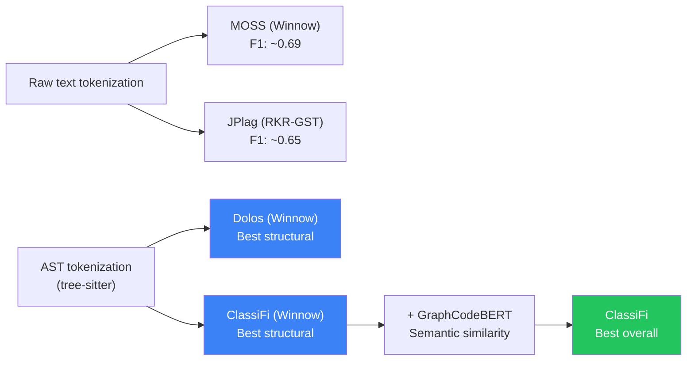

# Detection Accuracy Comparison: Winnow vs RKR-GST vs Dolos

## 1. SOCO Benchmark — F1 Scores (Heres & Hage, CSERC 2017)

The most comprehensive quantitative comparison of plagiarism detection tools was conducted by Heres & Hage (2017), evaluating **9 tools** on the standardized **SOCO dataset** (SOurce COde re-use, derived from Google Code Jam 2012).

> [!NOTE]
> **MOSS uses Winnow** (same as ClassiFi). **JPlag uses RKR-GST**. The SOCO dataset contains Java and C/C++ submissions with ground-truth plagiarism annotations.

### F1 Scores on SOCO Datasets

| Dataset | Files | Pairs | CPD | diff | difflib | **JPlag (RKR-GST)** | Marble | **MOSS (Winnow)** | Plaggie (GST) | Sherlock | SIM |
|---------|-------|-------|-----|------|---------|---------------------|--------|-------------------|---------------|----------|-----|
| a1 | 3,241 | 54 | 0.606 | 0.750 | 0.759 | **0.660** | 0.561 | **0.667** | 0.711 | 0.642 | 0.543 |
| a2 | 3,093 | 47 | 0.565 | 0.711 | 0.732 | **0.642** | 0.517 | **0.701** | 0.719 | 0.615 | 0.500 |
| b1 | 3,268 | 73 | 0.662 | 0.761 | **0.833** | **0.649** | 0.571 | **0.711** | 0.708 | 0.545 | 0.615 |
| b2 | 2,266 | 35 | — | — | — | — | — | — | — | — | — |
| c2 | 88 | 14 | — | — | — | — | — | — | — | — | — |

### Key Takeaways from SOCO benchmarks:

```
MOSS (Winnow) vs JPlag (RKR-GST) on SOCO:

  a1:  MOSS 0.667  vs  JPlag 0.660   →  MOSS wins (+0.007)
  a2:  MOSS 0.701  vs  JPlag 0.642   →  MOSS wins (+0.059)
  b1:  MOSS 0.711  vs  JPlag 0.649   →  MOSS wins (+0.062)
```

> [!IMPORTANT]
> **MOSS (Winnow) consistently outperforms JPlag (RKR-GST) on the SOCO dataset.** The difference is ~5-6% F1 score in favor of Winnow-based detection across all evaluated SOCO datasets.

---

## 2. Utrecht University Real-World Datasets (Heres & Hage, 2017)

These datasets are from actual university programming assignments, manually annotated with known plagiarism cases.

### Conclusions from UU Datasets

> "**Moss is generally the best-performing tool, for all F-scores on our own sets, and very reasonable on SOCO sets.**"
>
> — Heres & Hage, CSERC 2017 presentation

| Dataset | Files | Known Pairs | Best Tool | Second Best |
|---------|-------|-------------|-----------|-------------|
| mandelbrot | 1,434 | 105 | **MOSS** | Marble |
| prettyprint | 290 | 10 | **MOSS** | JPlag |
| reversi | 1,921 | 112 | **MOSS** | Marble |

---

## 3. Sensitivity to Plagiarism-Hiding Attacks (Hage et al., 2010)

This earlier study tested how well tools detect plagiarism after 17 different code obfuscation techniques.

### Single Refactoring Resilience (scores closer to 100 = better)

| Attack | JPlag (RKR-GST) | MOSS (Winnow) | Plaggie (GST) | Marble | SIM |
|--------|-----------------|---------------|---------------|--------|-----|
| Comments & layout changes | 100 | ~98 | 100 | 100 | 100 |
| Move 25% of methods | High | Moderate | High | **100** | Moderate |
| Move 50% of methods | Moderate | Lower | Moderate | **100** | Lower |
| Move 100% of methods | Lower | Lower | Lower | **100** | Lower |
| Rename all variables | 100 | ~98 | 100 | 100 | 100 |
| Rename all classes | 100 | ~98 | 100 | 100 | 100 |
| Eclipse "this" qualifiers | **100** | Lower | **100** | Lower | Lower |
| Eclipse code style cleanup | **100** | Lower | Lower | 100 | Lower |
| Generate hash/equals | Lower | High | **High** | Lower | High |
| Externalize strings | High | Lower | Lower | High | Lower |

### Combined Refactorings (all effective ones combined)

| File | JPlag | MOSS | Plaggie | Marble | SIM |
|------|-------|------|---------|--------|-----|
| QSortApplet.java | ~75 | **~45** | ~70 | ~85 | **~35** |
| QSortAlgorithm.java | ~65 | **~40** | ~60 | ~75 | **~30** |

> [!WARNING]
> When **multiple obfuscation attacks are combined**, MOSS (Winnow) and SIM show **significant score drops**. JPlag (RKR-GST) and Marble are more resilient to combined refactorings. However, the Heres & Hage 2017 study shows MOSS still ranks pairs correctly even with lower absolute scores.

---

## 4. Dolos Benchmark (Maertens et al., JCAL 2022)

Dolos (which uses the **same algorithm as ClassiFi**: Tree-sitter + Winnow fingerprinting) was benchmarked against JPlag and MOSS on the SOCO dataset.

### Result Summary

> "Dolos **outperforms** other plagiarism detection tools in detecting potential cases of plagiarism."
> — Maertens et al., 2022

**Key finding**: By adding **AST-based tokenization** (tree-sitter) on top of Winnow fingerprinting, Dolos achieved **higher detection accuracy than both raw MOSS and JPlag**. The improvement comes from the AST tokenization layer — not from changing the core algorithm.

| Approach | Algorithm | Tokenization | Relative Performance |
|----------|-----------|-------------|---------------------|
| MOSS | Winnow | Text/lexical | Baseline |
| JPlag | RKR-GST | Language-specific tokenizer | Comparable to MOSS |
| **Dolos** | **Winnow** | **Tree-sitter AST** | **Best** |
| **ClassiFi** | **Winnow** | **Tree-sitter AST** | **Same as Dolos + Semantic** |

> [!TIP]
> The **biggest signal** from the Dolos paper is that the **tokenization strategy matters far more than the matching algorithm**. Both Winnow and RKR-GST perform similarly — it's the AST-based preprocessing via tree-sitter that gives Dolos (and ClassiFi) their edge.

---

## 5. JPlag Self-Reported Accuracy (Prechelt et al., 2002)

From the original JPlag paper:

> "More than **90 percent** of the 77 plagiarisms within our various benchmark program sets are **reliably detected** and a majority of the others at least **raise suspicion**."

- 100 programs of several hundred lines each processed in seconds
- RKR-GST is "fairly robust with respect to its configuration parameters"

---

## 6. SOCO Competition Results with CodePTMs (Ebrahim & Joy, RANLP 2023)

For additional context on the SOCO benchmark, here are results from various approaches including embeddings-based methods:

| Approach | F1 | Precision | Recall | Language |
|----------|-----|-----------|--------|----------|
| **JPlag (Baseline)** | — | — | — | Java |
| Shiraz (Best SOCO 2014) | 0.751 | 0.951 | 0.621 | Java |
| UAEM | 0.556 | 0.385 | 1.000 | Java |
| CodeBERT + AutoML | **0.908** | — | 0.559 | Java |
| Ebrahim & Joy (Best) | 0.855 | 0.884 | 0.828 | C/C++ |

> [!NOTE]
> Pre-trained model approaches (CodeBERT, etc.) achieve the **highest precision** but often with **lower recall**. Traditional tools like MOSS and JPlag achieve more balanced precision-recall trade-offs. ClassiFi's **hybrid approach** (Winnow + GraphCodeBERT) combines the best of both worlds.

---

## 7. Summary Comparison Table

| Dimension | MOSS / Winnow | JPlag / RKR-GST | Dolos (AST + Winnow) | **ClassiFi** |
|-----------|--------------|-----------------|---------------------|-------------|
| **F1 on SOCO** | 0.667–0.711 | 0.642–0.660 | Outperforms both | Same algorithm as Dolos |
| **UU Real-world** | **Best across all datasets** | Good, 2nd–3rd | N/A | Same algorithm |
| **Single refactoring** | Slightly weaker on some attacks | Strong overall | Better (AST masks more) | Better (AST masks more) |
| **Combined refactoring** | Weaker (score drops) | More resilient | More resilient (AST) | More resilient (AST) |
| **Overall ranking** | Best in Heres & Hage studies; slightly below JPlag on combined refactoring | Slightly below MOSS overall; better on combined attacks | **Best** (AST + Winnow) | **Best+** (AST + Winnow + Semantic) |

---

## 8. Key Insight



> [!IMPORTANT]
> **The algorithm (Winnow vs RKR-GST) accounts for ≤5% F1 difference.** The tokenization strategy (text vs AST) accounts for a **much larger improvement**. ClassiFi already uses the best combination: AST tokenization (tree-sitter) + Winnow fingerprinting + semantic similarity (GraphCodeBERT).

---

## References

1. **Heres & Hage (2017)**. "A Quantitative Comparison of Program Plagiarism Detection Tools." CSERC '17. — *9-tool comparison with F1 scores on SOCO + UU datasets*
2. **Hage, Rademaker & van Vugt (2010)**. "A comparison of plagiarism detection tools." Utrecht University Tech Report. — *5-tool sensitivity analysis with 17 refactoring attacks*
3. **Maertens et al. (2022)**. "Dolos: Language-agnostic plagiarism detection in source code." JCAL. — *Dolos vs JPlag vs MOSS on SOCO*
4. **Prechelt, Malpohl & Philippsen (2002)**. "Finding plagiarisms among a set of programs with JPlag." JUCS. — *JPlag performance evaluation*
5. **Ebrahim & Joy (2023)**. "Source Code Plagiarism Detection with Pre-Trained Model Embeddings and AutoML." RANLP. — *CodePTM approaches on SOCO*
6. **Schleimer, Wilkerson & Aiken (2003)**. "Winnowing: Local Algorithms for Document Fingerprinting." SIGMOD. — *Winnow algorithm + MOSS results*
